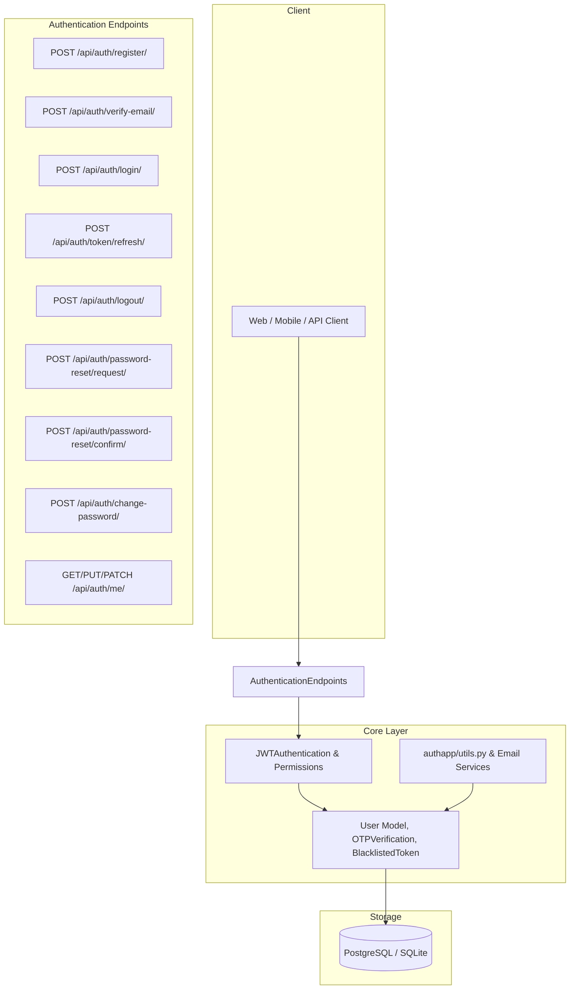

# Implementation Plan: Authentication System for Africlay Server

Design and implement a secure, production-ready, and Swagger-documented authentication system for the **Africlay Server** based on the schema and modern Django REST Framework authentication best practices.

---

## User Review Required

> [!IMPORTANT]
> **Custom User Model Setup (`AUTH_USER_MODEL = 'authapp.User'`)**:
> Setting the custom user model must be configured in `settings.py` before running initial migrations so that all Django built-in apps and foreign keys point to the new `User` model.

> [!NOTE]
> **Dependencies**:
> We will add `pyjwt` to `pyproject.toml` (needed by `authapp/utils.py`).

---

## Architecture Overview & Schema Alignment

Based on the **Africlay Database Schema** (`Afrciclay schema 1.jpg` & `Africlay_django_schema.jpg`), the user entity and authentication workflow will be structured as follows:



---

## Proposed Changes

### 1. Dependencies & Settings

#### [MODIFY] [pyproject.toml](file:///Users/edwin/Africlay/Africlay-server/pyproject.toml)
- Add `pyjwt` to dependencies.

#### [MODIFY] [africlay_server/settings.py](file:///Users/edwin/Africlay/Africlay-server/africlay_server/settings.py)
- Set `AUTH_USER_MODEL = 'authapp.User'`.
- Configure `REST_FRAMEWORK` with `DEFAULT_AUTHENTICATION_CLASSES = ('authapp.authentication.JWTAuthentication',)` and `DEFAULT_PERMISSION_CLASSES`.
- Configure `SPECTACULAR_SETTINGS` with Bearer JWT Security definitions (`SECURITY = [{'BearerAuth': []}]` and `APPEND_COMPONENTS`).
- Configure Email backend (console backend for development: `EMAIL_BACKEND = 'django.core.mail.backends.console.EmailBackend'`).

---

### 2. Models Layer (`authapp/models.py`)

#### [MODIFY] [authapp/models.py](file:///Users/edwin/Africlay/Africlay-server/authapp/models.py)
- **`User`** (`AbstractBaseUser`, `PermissionsMixin`):
  - `id`: `models.UUIDField(primary_key=True, default=uuid.uuid4, editable=False)`
  - `email`: `models.EmailField(unique=True, db_index=True)` *(used as `USERNAME_FIELD`)*
  - `phone_number`: `models.CharField(max_length=20, blank=True, null=True, unique=True)`
  - `role`: Choices (`'buyer'`, `'seller'`, `'both'`, `'admin'`, `'super_admin'`) - default `'buyer'`
  - `is_verified`: `models.BooleanField(default=False)`
  - `is_active`: `models.BooleanField(default=True)`
  - `is_staff`: `models.BooleanField(default=False)`
  - `is_superuser`: `models.BooleanField(default=False)`
  - `date_joined`: `models.DateTimeField(auto_now_add=True)`
  - `updated_at`: `models.DateTimeField(auto_now=True)`
  - `last_login`: `models.DateTimeField(blank=True, null=True)`
  - Custom `UserManager` (`BaseUserManager`) for `create_user` and `create_superuser`.

- **`UserProfile`** (`models.Model`):
  - `id`: `models.UUIDField(primary_key=True, default=uuid.uuid4, editable=False)`
  - `user`: `models.OneToOneField(User, on_delete=models.CASCADE, related_name='profile')`
  - `first_name`: `models.CharField(max_length=150, blank=True, default='')`
  - `last_name`: `models.CharField(max_length=150, blank=True, default='')`
  - `avatar`: `models.ImageField(upload_to='avatars/', blank=True, null=True)`
  - `avatar_url`: `models.URLField(blank=True, null=True)`
  - `bio`: `models.TextField(blank=True, null=True)`
  - `notification_preferences`: `models.JSONField(default=dict, blank=True)`
  - `created_at`: `models.DateTimeField(auto_now_add=True)`
  - `updated_at`: `models.DateTimeField(auto_now=True)`

- **`UserAddress`** (`models.Model`):
  - `id`: `models.UUIDField(primary_key=True, default=uuid.uuid4, editable=False)`
  - `user`: `models.ForeignKey(User, on_delete=models.CASCADE, related_name='addresses')`
  - `address_type`: Choices (`'shipping'`, `'billing'`, `'both'`) - default `'shipping'`
  - `recipient_name`: `models.CharField(max_length=255, blank=True, default='')`
  - `phone_number`: `models.CharField(max_length=20, blank=True, default='')`
  - `street_address`: `models.CharField(max_length=255)`
  - `apartment_suite`: `models.CharField(max_length=255, blank=True, null=True)`
  - `city`: `models.CharField(max_length=100)`
  - `state_province`: `models.CharField(max_length=100, blank=True, null=True)`
  - `postal_code`: `models.CharField(max_length=20, blank=True, null=True)`
  - `country`: `models.CharField(max_length=100)`
  - `country_code`: `models.CharField(max_length=10, blank=True, null=True)`
  - `is_default`: `models.BooleanField(default=False)`
  - `created_at`: `models.DateTimeField(auto_now_add=True)`
  - `updated_at`: `models.DateTimeField(auto_now=True)`

- **`OTPVerification`**:
  - `id`: `models.UUIDField(primary_key=True, default=uuid.uuid4, editable=False)`
  - `user`: `models.ForeignKey(User, on_delete=models.CASCADE, related_name='otp_codes')`
  - `otp_code`: `models.CharField(max_length=6)`
  - `otp_type`: Choices (`'email_verification'`, `'password_reset'`)
  - `created_at`: `models.DateTimeField(auto_now_add=True)`
  - `expires_at`: `models.DateTimeField()`
  - `is_used`: `models.BooleanField(default=False)`

- **`BlacklistedToken`**:
  - `id`: `models.UUIDField(primary_key=True, default=uuid.uuid4, editable=False)`
  - `token_id`: `models.CharField(max_length=255, unique=True, db_index=True)`
  - `user`: `models.ForeignKey(User, on_delete=models.CASCADE, null=True, blank=True, related_name='blacklisted_tokens')`
  - `blacklisted_at`: `models.DateTimeField(auto_now_add=True)`
  - `expires_at`: `models.DateTimeField()`

#### [MODIFY] [authapp/admin.py](file:///Users/edwin/Africlay/Africlay-server/authapp/admin.py)
- Register `User`, `UserProfile`, `UserAddress`, `OTPVerification`, and `BlacklistedToken` in Django Admin with customized list views, filters, and search fields.

---

### 3. Authentication & Utilities (`authapp/authentication.py`, `authapp/utils.py`, `authapp/permissions.py`)

#### [NEW] [authapp/authentication.py](file:///Users/edwin/Africlay/Africlay-server/authapp/authentication.py)
- Custom `JWTAuthentication` class:
  - Validates `Bearer <token>` in `Authorization` header
  - Decodes token using `settings.SECRET_KEY`
  - Verifies token expiration and checks `BlacklistedToken`
  - Retrieves active `User` instance
  - Returns `(user, validated_token)`

#### [NEW] [authapp/permissions.py](file:///Users/edwin/Africlay/Africlay-server/authapp/permissions.py)
- `IsAuthenticated` (DRF standard)
- `IsSeller`, `IsBuyer`, `IsAdmin`, `IsVerifiedUser`

#### [MODIFY] [authapp/utils.py](file:///Users/edwin/Africlay/Africlay-server/authapp/utils.py)
- Refine existing `generate_access_token`, `generate_refresh_token`, and `refresh_access_token` to include `jti` (unique token id for revocation) and standard claims.
- Add `generate_otp()`, `send_verification_email()`, `send_password_reset_email()`, and `send_password_changed_email()`.

---

### 4. Serializers (`authapp/serializers.py`)

#### [NEW] [authapp/serializers.py](file:///Users/edwin/Africlay/Africlay-server/authapp/serializers.py)
- **`UserRegistrationSerializer`**: Email validation, strong password validation, password confirmation, name fields, role selection.
- **`UserLoginSerializer`**: Email and password validation, returns user object and tokens.
- **`TokenRefreshSerializer`**: Validates refresh token, returns new access & refresh token.
- **`LogoutSerializer`**: Accepts refresh token to blacklist.
- **`VerifyEmailSerializer`**: Validates 6-digit OTP code and marks email as verified.
- **`ResendOTPSerializer`**: Resends verification OTP.
- **`PasswordResetRequestSerializer`**: Accepts email, generates reset OTP, and dispatches reset email.
- **`PasswordResetConfirmSerializer`**: Validates OTP and sets new password.
- **`ChangePasswordSerializer`**: Validates old password and sets new password for authenticated users.
- **`UserProfileSerializer`**: Serializes complete user data (read-only sensitive fields).
- **`UserProfileUpdateSerializer`**: Allows updating first_name, last_name, phone_number, city, country, avatar, notification_preferences.

---

### 5. Class-Based Views (`authapp/views.py`)

#### [MODIFY] [authapp/views.py](file:///Users/edwin/Africlay/Africlay-server/authapp/views.py)
Implement all Class-Based Views (CBVs) using DRF generics / `APIView`, fully documented with `@extend_schema`:
- **`RegisterView`** (`generics.CreateAPIView`): User registration with email verification trigger.
- **`VerifyEmailView`** (`APIView`): Verifies OTP and activates/verifies the account.
- **`ResendVerificationOTPView`** (`APIView`): Resends email verification code.
- **`LoginView`** (`APIView`): Authenticates credentials and returns access/refresh JWT tokens + user profile.
- **`TokenRefreshView`** (`APIView`): Refreshes JWT tokens.
- **`LogoutView`** (`APIView`): Blacklists refresh token.
- **`PasswordResetRequestView`** (`APIView`): Dispatches password reset OTP email.
- **`PasswordResetConfirmView`** (`APIView`): Verifies reset OTP and updates user password.
- **`ChangePasswordView`** (`APIView`): Allows authenticated user to update their password.
- **`UserProfileView`** (`generics.RetrieveUpdateAPIView`): View and update the logged-in user's profile.

---

### 6. Email Templates

#### [NEW] [authapp/templates/emails/email_verification.html](file:///Users/edwin/Africlay/Africlay-server/authapp/templates/emails/email_verification.html) & [.txt](file:///Users/edwin/Africlay/Africlay-server/authapp/templates/emails/email_verification.txt)
- Modern, clean HTML and plain text email template containing the 6-digit verification code.

#### [NEW] [authapp/templates/emails/password_reset.html](file:///Users/edwin/Africlay/Africlay-server/authapp/templates/emails/password_reset.html) & [.txt](file:///Users/edwin/Africlay/Africlay-server/authapp/templates/emails/password_reset.txt)
- Password reset email template containing the OTP code and expiration notice.

#### [NEW] [authapp/templates/emails/password_changed.html](file:///Users/edwin/Africlay/Africlay-server/authapp/templates/emails/password_changed.html) & [.txt](file:///Users/edwin/Africlay/Africlay-server/authapp/templates/emails/password_changed.txt)
- Security notification email confirming the password change.

---

### 7. URL Routing (`authapp/urls.py` and `africlay_server/urls.py`)

#### [NEW] [authapp/urls.py](file:///Users/edwin/Africlay/Africlay-server/authapp/urls.py)
Endpoints:
- `POST /api/auth/register/`
- `POST /api/auth/verify-email/`
- `POST /api/auth/resend-verification/`
- `POST /api/auth/login/`
- `POST /api/auth/token/refresh/`
- `POST /api/auth/logout/`
- `POST /api/auth/password-reset/`
- `POST /api/auth/password-reset/confirm/`
- `POST /api/auth/change-password/`
- `GET/PUT/PATCH /api/auth/me/`

#### [MODIFY] [africlay_server/urls.py](file:///Users/edwin/Africlay/Africlay-server/africlay_server/urls.py)
- Include `path('api/auth/', include('authapp.urls'))`.

---

## Verification Plan

### Automated / CLI Tests
1. **Dependency check**:
   ```bash
   uv add pyjwt
   ```
2. **Django System Check & Migrations**:
   ```bash
   make makemigrations
   make migrate
   ```
3. **Unit Tests**:
   - Write comprehensive unit tests in `authapp/tests.py` covering:
     - User model creation and custom `UserManager`
     - Registration and duplicate email handling
     - Login with valid and invalid credentials
     - Email verification OTP flow
     - Token refresh and token revocation / logout
     - Password reset request and confirmation
     - Change password endpoint
     - User profile view and update (`/api/auth/me/`)
   - Run tests:
     ```bash
     make test
     ```
4. **Swagger OpenAPI Schema Validation**:
   - Verify OpenAPI schema generation:
     ```bash
     uv run python manage.py spectacular --file schema.yml
     ```
   - Check Swagger UI endpoint `http://127.0.0.1:8000/api/docs/` for complete OpenAPI documentation and Bearer authentication tags.
